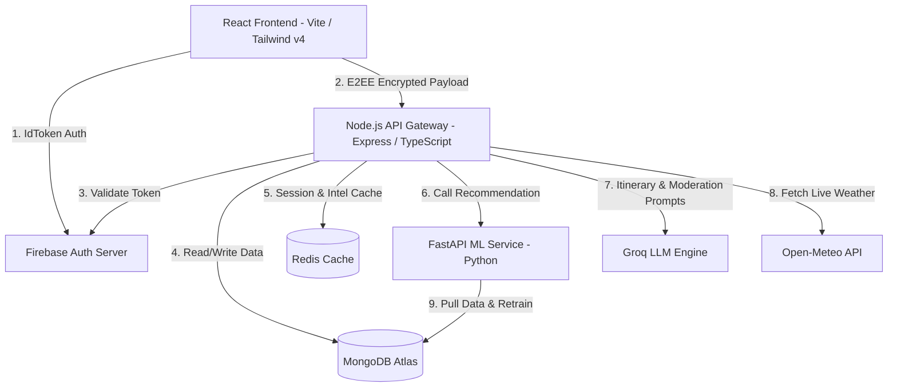

# Project Title: **AdventureNexus**
### Subtitle: *A Trust-Modulated AI Travel Ecosystem with End-to-End Encrypted Social Collaboration and Decentralized Ledgers*

---

## 📄 Abstract

In the contemporary digital landscape, travel planning remains a fragmented, time-consuming, and highly isolated process. Travelers must navigate dozens of disparate systems for itinerary planning, booking, weather forecasting, real-time safety tracking, secure communication, and expense management. Moreover, coordinating joint travels brings significant security challenges, including susceptibility of group chat communication metadata to third-party data harvesting, lack of real-time crowd dynamics, and complex debt settling among participants.

To resolve these fragmentation and security challenges, this project presents **AdventureNexus**, an AI-powered travel planning and social web application. AdventureNexus integrates advanced artificial intelligence, cryptography, and graph theory into a unified, responsive platform. The application is built on a multi-tier microservice architecture consisting of a React + Vite + Tailwind CSS v4 frontend, a Node.js + Express + TypeScript API gateway, and a Python + FastAPI Machine Learning microservice.

The system's core capabilities are driven by six key architectural pillars:
1. **AI Travel & Itinerary Builder**: Utilizing the Groq Large Language Model (LLM) API, the system automatically constructs day-by-day travel itineraries containing detailed activities, hotel options, local points of interest, and maps powered by OpenStreetMap.
2. **End-to-End Encrypted (E2EE) Chat**: Group and direct communications are secured using the TweetNaCl cryptographic suite, implementing X25519 Elliptic-curve Diffie-Hellman (ECDH) key agreements, XSalsa20 stream ciphers, and Poly1305 Message Authentication Codes (MACs). Private keys are isolated locally in IndexedDB to prevent Cross-Site Scripting (XSS) extraction, and group chats are secured via per-recipient fan-out encryption.
3. **Smart Expense Ledger**: Financial tracking utilizes a greedy graph-minimization netting algorithm to minimize debt transactions among group members, supplemented by an AI-driven anomaly detector that evaluates spending patterns.
4. **Live Travel Intelligence**: The platform queries geocoding lookups via Nominatim, forecasts weather through the Open-Meteo API, and computes localized crowd density indexes and risk levels (safe, caution, danger) before recommending optimal hourly visiting windows.
5. **Social Trust Shield & Toxicity Engine**: An automated moderation layer runs asynchronous content checks via Groq LLM, flags toxic or spam posts, and assesses fake reviews using the Jaccard Similarity index. A dynamic user trust rating is computed (scale 0-100) to adjust content visibility, automatically boosting highly trusted travel advisors and censoring high-risk bot behavior.
6. **Admin Observability & Traffic Simulator**: To test system scalability, concurrency, and real-time Socket.io events under load, the platform features a background traffic injector simulating user signups, itinerary creations, community interactions, and comments.

Ultimately, AdventureNexus offers a secure, scalable, and intelligent ecosystem that simplifies travel logistics, guarantees data privacy, and builds a trusted network for travel companions.

---

## 🧩 Architectural Blueprint

AdventureNexus utilizes a three-tier architectural layout:

---

## 🛠️ Detailed Subsystem Breakdown

### 1. End-to-End Encrypted (E2EE) Chat Subsystem
* **Cryptographic Primitives**: Employs X25519 Elliptic Curve Diffie-Hellman for key exchange, XSalsa20 for high-performance stream encryption, and Poly1305 for cryptographic message integrity.
* **IndexedDB Sandboxing**: To eliminate XSS vectors targeting `localStorage`, private keys are stored in a dedicated IndexedDB database (`NexusE2EE`, store: `keys`).
* **Group Fan-out Encryption**: For a group message, the sender client encrypts the text independently for each recipient using the recipient's respective public key, uploading the collection of ciphertexts to the backend database. Each recipient pulls the message, filters for their specific recipient ID, and decrypts the content locally.

### 2. FastAPI Content-Based Recommender
* **Algorithm**: Implements content-based filtering. User profiles are created by combining explicit preferences and vocabulary extracted from their past created plans.
* **Vectorization**: Vectorized using TF-IDF (Term Frequency-Inverse Document Frequency) vectorization.
* **Scoring**: Computes cosine similarity matrices between the user vector and plan embeddings.
* **Trust Filtering**: Recommendable plans are modulated by the trust score of the creator. Plans created by users with a trust rating below $30$ are automatically filtered out, while plans from users with trust ratings above $80$ receive a $1.2\times$ visibility boost.

### 3. Expense Netting & Settlement Minimizer
* **Debt Netting**: Implements a greedy algorithm to reduce settlement transactions. Users with positive balances (creditors) and negative balances (debtors) are sorted in descending order of their net positions. The algorithm iteratively resolves the minimum of the absolute debtor and creditor balances, achieving an optimized $O(V + E)$ reduction in transfers.
* **AI Insights**: Scans group expenses to generate warnings for high debtors (debts exceeding ₹150) and flags spending skewness (e.g., when a single traveler pays for >60% of all group costs).

### 4. Live Travel Intelligence
* **Dynamic Geocoding**: Translates locations into latitudes and longitudes using a Nominatim OSM API request, falling back to a deterministic location-name hash resolver if offline.
* **Weather & Crowd API**: Integrates Open-Meteo weather parameters (precipitation, temperature, wind, UV index) and computes crowd levels ('low', 'medium', 'high') by querying search, booking, and post records in the database.
* **Risk & Visiting Window Evaluator**: Assesses safety levels ('safe', 'caution', 'danger') using weather telemetry, crime records, and system alerts. An hourly recommendation algorithm determines the best time window (e.g., 7:00 AM - 9:00 AM for high-crowd locations, 6:00 PM - 8:00 PM for high-heat areas).

### 5. Social Trust Shield & Bot Detector
* **AI Moderation**: Content is audited asynchronously via Groq LLM to check for spam, toxicity, hate speech, and sexual content.
* **Jaccard Similarity Check**: Review fraud is prevented by checking text similarity between testimonials. If Jaccard similarity exceeds $0.6$ on reviews, they are marked suspicious.
* **Dynamic Trust Profile**: User trust ratings are re-calculated dynamically using:
  $$\text{Trust Score} = 100 - (\text{Toxicity} \times 30) - (\text{Spam} \times 20) - (\text{Reports} \times 5) - (\text{Fake Reviews} \times 20)$$
  where spam accounts for AI moderation flags and bot behavior checks (like registering >15 actions per hour).

### 6. System Traffic Load Simulator
* **Simulation Loop**: Injects synthetic user activity (user registrations, itinerary generation, community comments, posts, likes, reviews) dynamically at configured millisecond intervals.
* **Scale Testing**: Serves as a diagnostic harness to evaluate Redis caching hits, Socket.io broadcast latency, and DB concurrency.

---

## 🎯 Presentation Slide Quick Reference

| Slide Topic | Key Presenting Points | Source Implementation Reference |
| :--- | :--- | :--- |
| **The Problem** | Fragmented planning; security concerns in chats; complex group expense splits. | `README.md:L60-67` |
| **System Tech Stack** | React 18, Vite, Tailwind v4, Express, FastAPI, MongoDB, Redis. | `README.md:L20-41` |
| **Itinerary Planner** | Groq-generated travel routines with OSM maps integrations. | `newPlanController.ts:L50-77` |
| **P2P Cryptography** | P2P Client encryption (TweetNaCl). IndexedDB sandbox protects keys. | `cryptoEngine.js`, `keyManager.js` |
| **Financial Ledger**| Greedy netting algorithm minimizing transactions. | `expenseEngine.ts:L107-175` |
| **Travel Intelligence**| Live weather (Open-Meteo), crowd density score, optimal visiting window. | `travelIntelService.ts`, `riskAnalyzer.ts` |
| **Trust Shield** | Dynamic user trust formula adjusting plan visibility. | `trustEngine.ts:L178-188` |
| **Load Testing** | Traffic Simulator generating mock activities via Socket.io. | `trafficSimulator.ts` |
