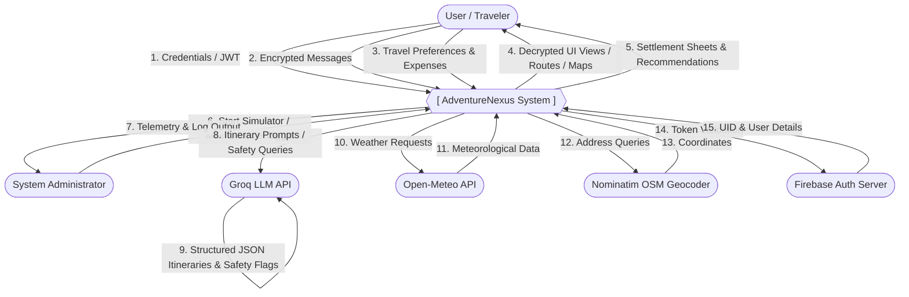
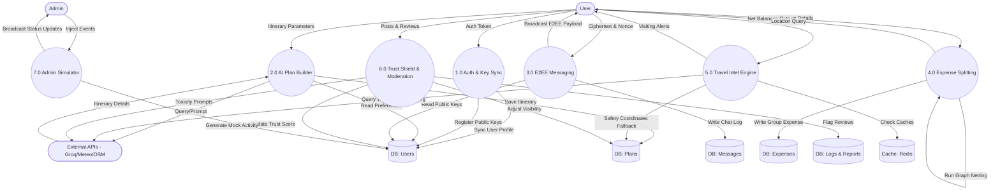
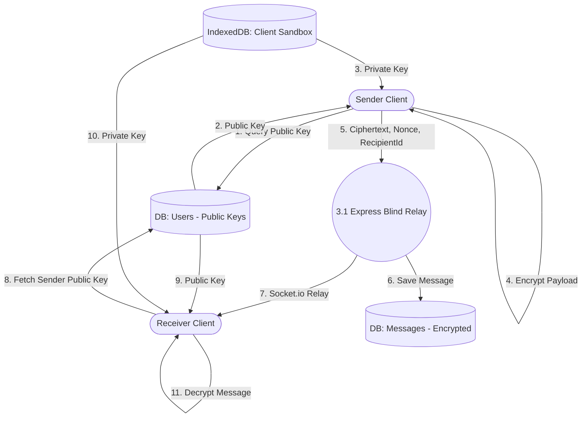
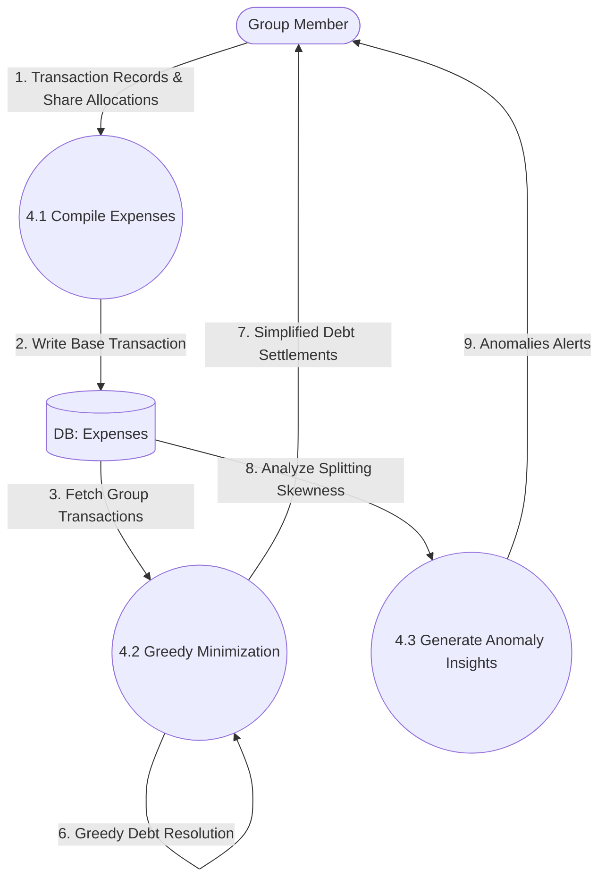
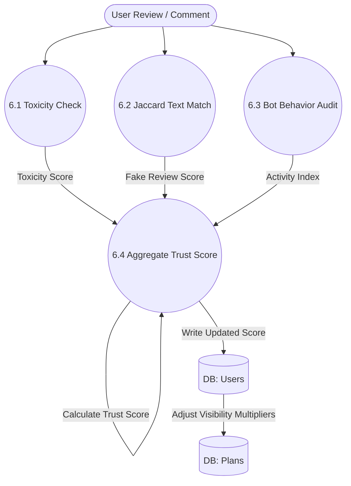

# Data Flow Diagram (DFD): **AdventureNexus**
### Level 0, Level 1, and Level 2 Data Flow Specifications

---

## 1. DFD Level 0: Context Diagram

The Context Diagram defines the boundary of the AdventureNexus system, identifying external entities that feed data into the application or receive data from it.

---

## 2. DFD Level 1: Process Decomposition

Level 1 DFD breaks the system down into core processes, illustrating how data flows between processes, external entities, and database stores.

---

## 3. DFD Level 2: Detailed Process Diagrams

### 3.1 Process 3.0: E2EE Messaging Data Flow
Decomposes the cryptographic messaging sequence to show how data is handled client-side and server-side.

### 3.2 Process 4.0: Expense Splitting & Netting Data Flow
Decomposes the financial calculations used to minimize transactions.

### 3.3 Process 6.0: Trust Score Calculation Data Flow
Decomposes the reputation-scoring mechanism.

