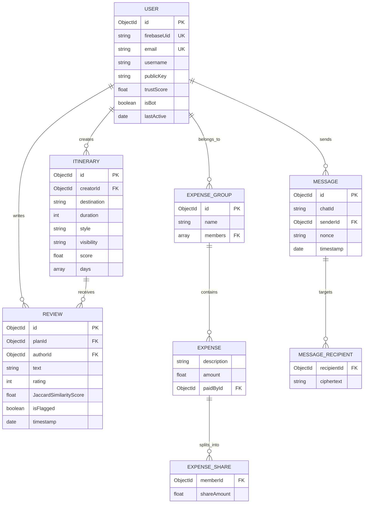

# Entity Relationship Diagram (ERD): **AdventureNexus**
### Logical Schemas, Key Attributes, Cardinality Mappings, and NoSQL Modeling Decisions

---

## 1. ERD Conceptual Mapping

AdventureNexus is modeled using MongoDB (NoSQL). The diagram below illustrates the logical entities, their attributes, and relationships. It uses standard Crow's Foot notation representing cardinalities:

---

## 2. Entity Attribute Specifications

### 2.1 User Entity (`users` collection)
Represents registered travelers on the platform.
* **`id`** (ObjectId, Primary Key): Unique internal database identifier.
* **`firebaseUid`** (String, Unique Index): Matches the user ID generated by Firebase Authentication.
* **`email`** (String, Unique Index): Registered email address.
* **`username`** (String): Display name.
* **`publicKey`** (String): X25519 public key used for E2EE payload wrapping.
* **`trustScore`** (Float): Numeric value (0.0 to 100.0) reflecting profile credibility.
* **`isBot`** (Boolean): System flag identifying automated/suspicious behavior.
* **`lastActive`** (Date): Timestamp tracking user interactions.

### 2.2 Itinerary Entity (`plans` collection)
Represents planned trips containing schedules.
* **`id`** (ObjectId, Primary Key): Unique itinerary identifier.
* **`creatorId`** (ObjectId, Foreign Key -> `users.id`): Links to the user who created the plan.
* **`destination`** (String): Geographic target name.
* **`duration`** (Integer): Number of travel days.
* **`style`** (String): Travel category (Adventure, Relaxed, Family).
* **`visibility`** (String): Access scope ('public' or 'private').
* **`score`** (Float): Popularity rank dynamically modulated by trust score.
* **`days`** (Array of Objects, Embedded): Contains detailed daily activities, time slots, mapping coordinates, and notes.

### 2.3 Message Entity (`messages` collection)
Represents encrypted chat transcripts.
* **`id`** (ObjectId, Primary Key): Message identifier.
* **`chatId`** (String, Indexed): Groups messages belonging to direct or group chat spaces.
* **`senderId`** (ObjectId, Foreign Key -> `users.id`): Identifies the message author.
* **`nonce`** (String): Cryptographic initialization value.
* **`recipients`** (Array of Objects, Embedded): Sub-array matching public keys to their corresponding ciphertext payloads:
  - **`recipientId`** (ObjectId, Foreign Key -> `users.id`): Targeted reader.
  - **`ciphertext`** (String): TweetNaCl encrypted binary data.
* **`timestamp`** (Date): Logging date.

### 2.4 Expense Group Entity (`expense_groups` collection)
Tracks group financial records.
* **`id`** (ObjectId, Primary Key): Group identifier.
* **`name`** (String): Group title.
* **`members`** (Array of ObjectIds, References -> `users.id`): List of participants sharing costs.
* **`expenses`** (Array of Objects, Embedded): Embedded expenses details:
  - **`description`** (String): Item description.
  - **`amount`** (Float): Cost amount.
  - **`paidById`** (ObjectId, Foreign Key -> `users.id`): Payer identifier.
  - **`shares`** (Array of Objects, Embedded): Split targets:
    - **`memberId`** (ObjectId, Foreign Key -> `users.id`): Debtor identifier.
    - **`shareAmount`** (Float): Owed balance.

### 2.5 Review Entity (`reviews` collection)
Tracks user feedback on travel itineraries.
* **`id`** (ObjectId, Primary Key): Review identifier.
* **`planId`** (ObjectId, Foreign Key -> `plans.id`): Target itinerary.
* **`authorId`** (ObjectId, Foreign Key -> `users.id`): Review writer.
* **`text`** (String): Review content.
* **`rating`** (Integer): Numeric rating (1 to 5).
* **`JaccardSimilarityScore`** (Float): Structural review match index.
* **`isFlagged`** (Boolean): Indicates whether the review was flagged by the moderation engine.

---

## 3. Database Modeling Decisions: Referencing vs. Embedding

AdventureNexus utilizes document-based data modeling to reduce query latency:

1. **Embedded Sub-documents (One-to-Many Relationships)**:
   - **Itinerary Days**: Embedded directly inside the `plans` document. Because days are read concurrently with the itinerary, embedding them eliminates query joins and speeds up load times.
   - **Expense Shares & Recipients**: Embedded inside their parent collections (`expense_groups` and `messages` respectively). This design prevents collection fragmentation and allows updates to run in a single write operation.
2. **Referenced Collections (Many-to-Many Relationships)**:
   - **Creators, Members, and Review Authors**: Referenced using MongoDB ObjectIds pointing to the `users` collection. This design ensures that profile changes (e.g. updating a username or public key) propagate automatically without requiring updates across millions of documents.
