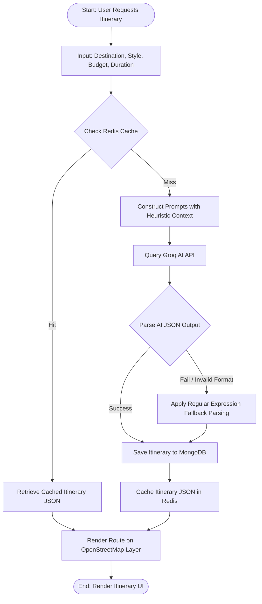
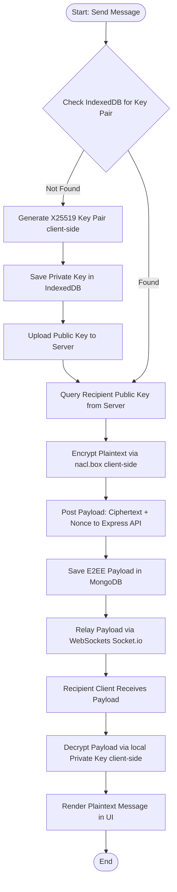
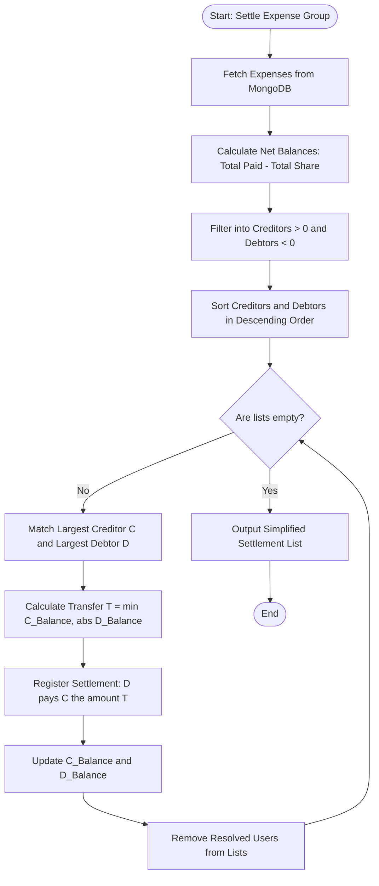
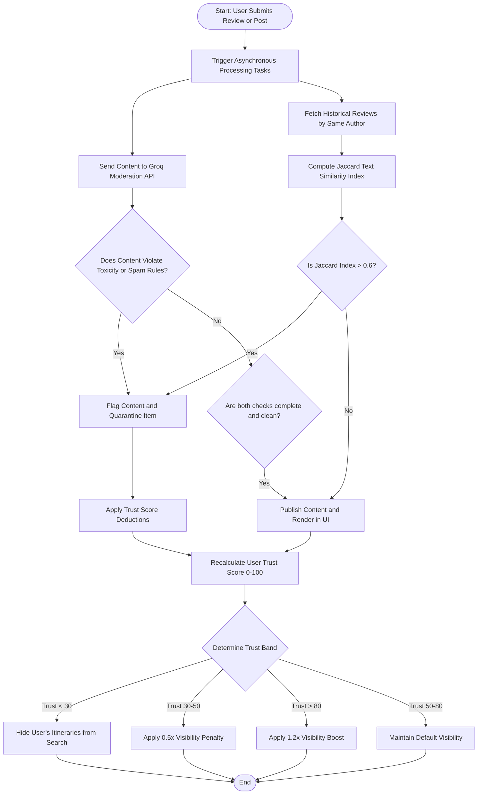

# System Flowcharts: **AdventureNexus**
### Procedural Logic, Decision Points, and System Workflows

---

## 1. AI Itinerary Generation Flowchart

This flowchart outlines the process of validating inputs, checking cache states, querying the LLM, and rendering itineraries.



---

## 2. E2EE Message Delivery Flowchart

This flowchart illustrates the zero-knowledge message path, highlighting the client-side cryptographic boundary.

```thought
The client-side encryption flow must detail key pair checks, encryption, and socket relays.
```



---

## 3. Expense Netting Settlement Flowchart

This flowchart displays the mathematical loop execution of the greedy netting minimization algorithm.



---

## 4. Content Moderation & Reputation Modulation Flowchart

This flowchart details the asynchronous safety checks, Jaccard Match evaluations, and visibility score adjustments.


