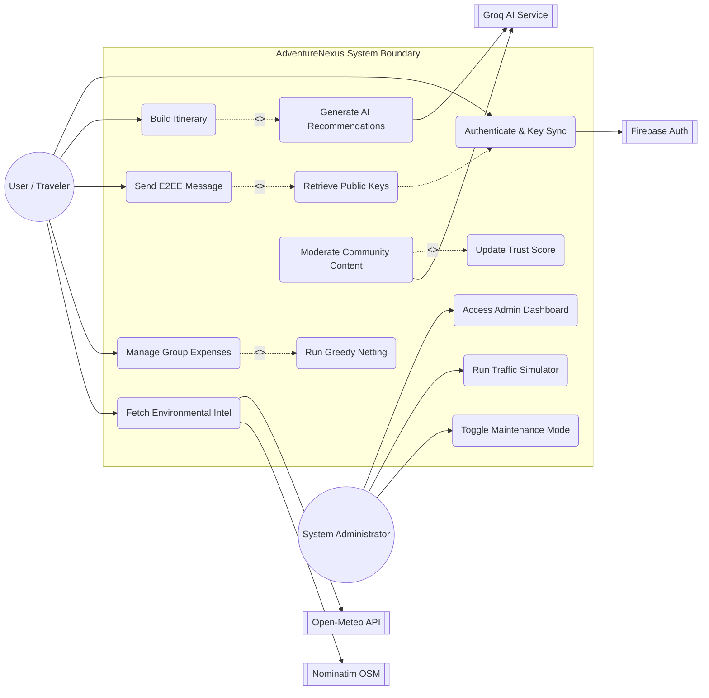

# Use Case Diagram: **AdventureNexus**
### System Boundaries, Actors, Use Case Relationships, and Operational Scenarios

---

## 1. System Boundary and Actor Definitions

AdventureNexus divides system functionality among primary, secondary, and supporting actors:

### A. Primary Actor: **User / Traveler**
The end-user who coordinates travel, communicates with companions, and tracks expenses.

### B. Secondary Actor: **System Administrator**
The operator responsible for monitoring server metrics, performing maintenance, and running load simulations.

### C. Supporting Actors (External Systems)
* **Firebase Authentication Service**: Validates JWT tokens and identifies user sessions.
* **Groq LLM Engine**: Generates itineraries and moderates text.
* **Open-Meteo API**: Resolves live meteorological parameters.
* **Nominatim Geocoding API**: Translates location text into latitude and longitude coordinates.

---

## 2. Use Case Diagram

The diagram below maps the relationships between actors and system use cases, including `<<include>>` and `<<extend>>` relationships:

---

## 3. Core Use Case Specifications

### 3.1 Use Case: Authenticate User
* **Actors**: User, Firebase Authentication Service.
* **Pre-conditions**: User must have a registered Google/Email credentials profile on Firebase.
* **Flow of Events**:
  1. The User provides login credentials to the frontend client.
  2. Firebase authenticates the session and returns an identity token.
  3. The client sends the token to the backend server.
  4. The backend validates the token using the Firebase Admin SDK.
  5. The client checks IndexedDB for an E2EE key pair, creating one if absent and uploading the public key to the backend.

### 3.2 Use Case: Generate AI Recommendations
* **Actors**: User, Groq AI Service.
* **Pre-conditions**: User must have authenticated successfully.
* **Flow of Events**:
  1. The User enters travel parameters (destination, style, budget, duration).
  2. The system formats these parameters into a structured prompt context.
  3. The system sends the prompt to the Groq API.
  4. The Groq API returns a structured JSON itinerary.
  5. The backend validates the response and saves the itinerary to the database, rendering the route coordinates on the map.

### 3.3 Use Case: Send E2EE Message
* **Actors**: User (Sender and Receiver).
* **Pre-conditions**: Both users must have registered X25519 public keys on the backend.
* **Flow of Events**:
  1. The Sender client retrieves the Receiver's public key from the database.
  2. The Sender client encrypts the message locally using TweetNaCl.
  3. The Sender client uploads the ciphertext and nonce to the server.
  4. The server relays the payload to the Receiver via Socket.io.
  5. The Receiver client retrieves the Sender's public key and decrypts the message locally.

### 3.4 Use Case: Run Greedy Netting
* **Actors**: User.
* **Pre-conditions**: The group ledger must contain unpaid expense entries.
* **Flow of Events**:
  1. The User initiates group debt settlement.
  2. The system calculates individual net balances.
  3. The netting engine matches debtors and creditors using a greedy transaction minimization algorithm.
  4. The client renders the simplified repayment list.

### 3.5 Use Case: Moderate Community Content
* **Actors**: User, Groq AI Service.
* **Pre-conditions**: User attempts to post community content or reviews.
* **Flow of Events**:
  1. The User submits a post or review.
  2. The system triggers an asynchronous moderation check.
  3. The Groq API evaluates the content for toxicity and spam flags.
  4. If flagged, the content is quarantined, and the system updates the creator's trust score.
