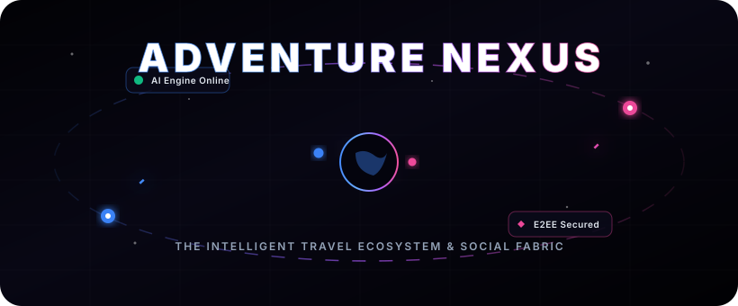
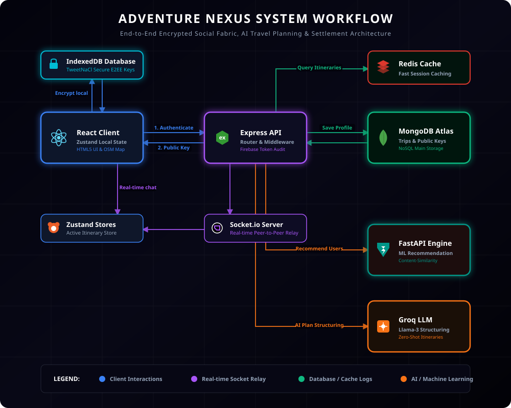

<!-- Premium Custom Animated Header Banner -->
<p align="center">
  
</p>

<p align="center">
  <a href="https://git.io/typing-svg">
    
  </a>
</p>

<p align="center">
  <a href="https://adventurenexus.vercel.app"><b>✨ Explore Live Portal</b></a> • 
  <a href="https://github.com/Samiran2004/AdventureNexus/issues"><b>🐛 Report An Issue</b></a> • 
  <a href="https://github.com/Samiran2004/AdventureNexus/issues"><b>💡 Request A Module</b></a>
</p>

---

## 🎨 Tech Stack & Integrations

<p align="center">
  
  
  
  
  
</p>
<p align="center">
  
  
  
  
  
</p>
<p align="center">
  
  
  
  
</p>

---

## 📚 Table of Contents
1. [🌍 System Overview & Problem Solved](#-system-overview--problem-solved)
2. [🧩 Architectural & System Workflow Blueprint](#-architectural--system-workflow-blueprint)
3. [✨ Key & Advanced Modules](#-key--advanced-modules)
4. [📁 Project Directory Map](#-project-directory-map)
5. [🔄 Core Execution Workflows](#-core-execution-workflows)
6. [🌐 Backend & ML API Reference](#-backend--ml-api-reference)
7. [🛡️ Security, Caching & Performance Engine](#️-security-caching--performance-engine)
8. [🚀 Getting Started & Installation](#-getting-started--installation)
9. [🤝 Contributing](#-contributing)
10. [📜 License](#-license)

---

## 🌍 System Overview & Problem Solved

> **The Problem**  
> Coordinating travel remains fragmented. Planning a trip requires crossing dozens of hotel, flight, and booking websites, spending an average of 10-15 hours. Furthermore, collaborating with travelers online brings safety concerns, coordination group chats lack client-side privacy protection, and expense splitting gets complicated across users.

> **The Solution**  
> **AdventureNexus** is an AI-powered travel planning and social web application. Using Groq, FastAPI Content Recommendation, and NaCl peer-to-peer encryption, users can instantly formulate plans, find matching travel companions, chat with zero-knowledge database relays, assess location safety in real time, and resolve debts seamlessly.

---

## 🧩 Architectural & System Workflow Blueprint

The following unified system blueprint maps the data paths, socket links, database logs, caching layers, and AI engines driving the travel ecosystem:

<p align="center">
  
</p>

---

## ✨ Key & Advanced Modules

<details>
  <summary><b>🧠 1. AI Planning & Itinerary Engine (Click to expand)</b></summary>
  <br/>

  AdventureNexus creates complete itineraries in seconds. It constructs day-by-day routines consisting of detailed schedules, activities, timings, and coordinates.
  * **Hotel Integration**: Dynamically assigns hotels with relative price structures, guest capacity ratings, and real-time reviews.
  * **Flight/Train Mapping**: Recommends appropriate travel flights and train carriers based on selected regions.
  * **OsmMap Routing**: Renders points of interest and paths interactively using leaf map nodes.
</details>

<details>
  <summary><b>💬 2. End-to-End Encrypted (E2EE) Chat (Click to expand)</b></summary>
  <br/>

  AdventureNexus secures all direct and group conversations. Peer-to-peer messaging uses key agreements where the server acts as a blind relay:
  * **TweetNaCl Protocol**: Uses X25519 Elliptic-curve Diffie-Hellman key agreement + XSalsa20 stream cipher + Poly1305 MAC.
  * **Client-Side Key Generation**: Private keys are generated on register/login and stored in IndexedDB (`NexusE2EE` database, `keys` store) instead of `localStorage` to block cross-site script (XSS) extraction.
  * **Per-Member Fan-out Group Encryption**: For group rooms, messages are encrypted independently using the recipient's respective public keys.
</details>

<details>
  <summary><b>💰 3. Expense Ledger & Debt Simplifier (Click to expand)</b></summary>
  <br/>

  Keep track of group expenditures. AdventureNexus resolves debts by minimizing transactions:
  * **Custom Splits**: Split by shares, percentage matrices, or unequal dollar amounts.
  * **Graph Minimization algorithm**: Simplifies group netting (e.g., if A owes B $10 and B owes C $10, A pays C $10 directly).
</details>

<details>
  <summary><b>🌦️ 4. Live Travel Intelligence Engine (Click to expand)</b></summary>
  <br/>

  Fetches real-time environmental context for travelers:
  * **Live Weather**: Connects to the Open-Meteo API for real-time climate telemetry (precipitation, UV index, relative humidity, wind speed).
  * **Crowd Density & Risk Scores**: Combines booking statistics, weather indices, and crime rates to evaluate location safety indexes.
  * **Hotspot Advisor**: Advises optimal visit times based on historical crowd levels.
</details>

<details>
  <summary><b>🛡️ 5. Social Trust Shield & Toxicity Engine (Click to expand)</b></summary>
  <br/>

  Keeps the platform clean and authentic:
  * **AI Toxicity Moderation**: Groq model parses comments/posts to quarantine toxic, abusive, or spam material.
  * **Review Fraud Detection**: Computes a Jaccard Text Similarity Index to check historical testimonials for duplicated phrasing or bot patterns.
</details>

<details>
  <summary><b>📊 6. Admin Observability Control Center (Click to expand)</b></summary>
  <br/>

  Provides system administrators with tools to monitor and manage the ecosystem:
  * **Traffic Simulator**: Injects mock user behavior (likes, post updates, travel searches) to test UI rendering and socket reliability.
  * **Audit Log Trail**: Logs all moderator events with severity indices (info, warning, quarantine).
  * **Telemetry Charts**: Displays real-time API latency averages, CPU loads, and error distributions.
</details>

---

## 📸 Core UI Visuals

### 🖥️ Desktop Dashboard

<p align="center">
  <b>Landing & Search Space</b><br/>
  
  
</p>

<p align="center">
  <b>Itinerary Builder & Final Result Reviews</b><br/>
  
  
</p>

### 📱 Responsive Mobile Layouts
<p align="center">
  &nbsp;&nbsp;
  &nbsp;&nbsp;
  
</p>

---

## 📁 Project Directory Map

### Backend Layout (Express + TypeScript)

| Directory / File | Type | Description / Responsibilities |
| :--- | :--- | :--- |
| 📂 `Backend/src/` | **Root** | Main Express + TypeScript application directory. |
| 📄 `├── app.ts` | **File** | Server entry point and HTTP middleware routing pipeline. |
| 📂 `├── config/` | **Folder** | Centralized server environment variables, API configurations, and keys. |
| 📂 `├── jobs/` | **Folder** | Background cron runner (handles metrics and automated rebuilder tasks). |
| 📂 `├── modules/` | **Folder** | Feature-domain modules: |
| &nbsp;&nbsp;&nbsp;&nbsp;&nbsp;&nbsp;📂 `├── admin/` | **Subfolder** | Admin tools, logs auditing, and live traffic simulation. |
| &nbsp;&nbsp;&nbsp;&nbsp;&nbsp;&nbsp;📂 `├── ai/` | **Subfolder** | Match Score calculators using cosine similarity parameters. |
| &nbsp;&nbsp;&nbsp;&nbsp;&nbsp;&nbsp;📂 `├── bookings/` | **Subfolder** | Accommodations integration modules and search APIs. |
| &nbsp;&nbsp;&nbsp;&nbsp;&nbsp;&nbsp;📂 `├── expenses/` | **Subfolder** | Ledger matching split algorithms and graph-minimization debt netting. |
| &nbsp;&nbsp;&nbsp;&nbsp;&nbsp;&nbsp;📂 `├── messaging/` | **Subfolder** | Conversation routers, E2EE public key lookup, and Socket relays. |
| &nbsp;&nbsp;&nbsp;&nbsp;&nbsp;&nbsp;📂 `├── planning/` | **Subfolder** | Manual and AI itinerary planners powered by Groq. |
| &nbsp;&nbsp;&nbsp;&nbsp;&nbsp;&nbsp;📂 `├── safety/` | **Subfolder** | Location safety trackers and user-alert logs. |
| &nbsp;&nbsp;&nbsp;&nbsp;&nbsp;&nbsp;📂 `└── travelIntel/` | **Subfolder** | Weather forecast APIs, crowd indicators, and hotspots trackers. |
| 📂 `└── shared/` | **Root** | Shared utility libraries: |
| &nbsp;&nbsp;&nbsp;&nbsp;&nbsp;&nbsp;📂 `├── database/` | **Subfolder** | Database connectors, Mongo schema initializers, and Mongoose models. |
| &nbsp;&nbsp;&nbsp;&nbsp;&nbsp;&nbsp;📂 `├── middleware/` | **Subfolder** | JWT validation guards, request sanitizers, and telemetry loggers. |
| &nbsp;&nbsp;&nbsp;&nbsp;&nbsp;&nbsp;📂 `├── redis/` | **Subfolder** | Redis caching connections and session managers. |
| &nbsp;&nbsp;&nbsp;&nbsp;&nbsp;&nbsp;📂 `└── socket/` | **Subfolder** | Socket.io event list listeners and live socket registries. |

<br/>

### Frontend Layout (React + Vite)

| Directory / File | Type | Description / Responsibilities |
| :--- | :--- | :--- |
| 📂 `frontend/src/` | **Root** | React frontend client application directory. |
| 📄 `├── App.jsx` | **File** | Main Router definition, page loading rules, and route guards. |
| 📂 `├── admin/` | **Folder** | Administrator dashboard pages, user tables, and metrics widgets. |
| 📂 `├── components/` | **Folder** | Reusable UI components, design layouts, and Framer Motion wrappers. |
| 📂 `├── context/` | **Folder** | Global context providers (Authentication, Socket connectors, Chat buffers). |
| 📂 `├── features/` | **Folder** | Feature modules: |
| &nbsp;&nbsp;&nbsp;&nbsp;&nbsp;&nbsp;📂 `├── community/` | **Subfolder** | Chat interfaces, user boards, profiles, and group elements. |
| &nbsp;&nbsp;&nbsp;&nbsp;&nbsp;&nbsp;📂 `├── legal/` | **Subfolder** | Terms of service, privacy policy, and usage disclaimer pages. |
| &nbsp;&nbsp;&nbsp;&nbsp;&nbsp;&nbsp;📂 `├── planning/` | **Subfolder** | Itinerary creators, maps layers, hotel lists, and search screens. |
| &nbsp;&nbsp;&nbsp;&nbsp;&nbsp;&nbsp;📂 `└── user/` | **Subfolder** | Authentication portals (login, signup) and user configurations. |
| 📂 `└── lib/` | **Folder** | Security protocols, TweetNaCl wrapper functions, and IndexedDB storage drivers. |

<br/>

### ML Layout (FastAPI + Python)

| Directory / File | Type | Description / Responsibilities |
| :--- | :--- | :--- |
| 📂 `ML/` | **Root** | Python-based FastAPI machine learning server directory. |
| 📂 `├── models/` | **Folder** | Saved TF-IDF vectorizers and similarity models. |
| 📂 `└── src/` | **Folder** | Recommender codebases: |
| &nbsp;&nbsp;&nbsp;&nbsp;&nbsp;&nbsp;📄 `├── main.py` | **File** | FastAPI application setup, router declarations, and endpoint bindings. |
| &nbsp;&nbsp;&nbsp;&nbsp;&nbsp;&nbsp;📄 `├── recommender.py` | **File** | Cosine Similarity recommendation matrix engines. |
| &nbsp;&nbsp;&nbsp;&nbsp;&nbsp;&nbsp;📄 `└── train.py` | **File** | Training pipelines (reads data from MongoDB, trains vectors, and saves models). |

---

## 🔄 Core Execution Workflows

### 1. Firebase Authentication Sync

The Express backend verifies client JWTs from Firebase Auth:

| Step | Source | Direction | Destination | Action / Payload Details |
| :--- | :--- | :---: | :--- | :--- |
| **1** | **Client App** | ➔ | **Firebase Server** | Requests IdToken for session setup. |
| **2** | **Firebase Server** | ➔ | **Client App** | Returns verified JWT IdToken. |
| **3** | **Client App** | ➔ | **Express Gateway** | `POST /users/register` containing JWT header. |
| **4** | **Express Gateway** | ➔ | **Firebase Admin SDK** | Authenticates JWT token credentials. |
| **5** | **Firebase Admin SDK** | ➔ | **Express Gateway** | Decodes verified User UID and Email. |
| **6** | **Express Gateway** | ➔ | **MongoDB Atlas** | Queries / Upserts user context matching `firebaseUid`. |
| **7** | **MongoDB Atlas** | ➔ | **Express Gateway** | Returns persistent database user document. |
| **8** | **Express Gateway** | ➔ | **Client App** | Returns session payload & initialized store context. |

<br/>

### 2. End-to-End Encrypted (E2EE) Chat

This workflow ensures that the database server never has access to the raw message payload:

| Step | Source | Direction | Destination | Action / Encryption Details |
| :--- | :--- | :---: | :--- | :--- |
| **1** | **Alice Client** | ➔ | **Alice Client** | Generates secure X25519 elliptic curve keypair. |
| **2** | **Alice Client** | ➔ | **IndexedDB** | Saves local private SecretKey to secure client sandbox. |
| **3** | **Alice Client** | ➔ | **Express Gateway** | Publishes public key to backend directory. |
| **4** | **Alice Client** | ➔ | **Express Gateway** | Queries public key matching destination (Bob's profile). |
| **5** | **Express Gateway** | ➔ | **Alice Client** | Returns Bob's X25519 public key. |
| **6** | **Alice Client** | ➔ | **Alice Client** | Encrypts payload with Bob's public key and local secret key (using `TweetNaCl`). |
| **7** | **Alice Client** | ➔ | **Express Gateway** | Transmits raw E2EE cipher packet + 24-byte unique Nonce. |
| **8** | **Express Gateway** | ➔ | **Bob Client** | Emits `chat:message` event via Socket.io relay. |
| **9** | **Bob Client** | ➔ | **Bob Client** | Decrypts socket packet using Alice's public key + Bob's local secret key. |

---

## 🌐 Backend & ML API Reference

### 🔐 User & Profile Routes
* `POST /api/v1/users/register` - Registers a session verifying Firebase tokens.
* `GET /api/v1/users/profile` - Fetches authenticated user data.
* `POST /api/v1/users/e2ee/public-key` - Uploads user X25519 public key.
* `GET /api/v1/users/e2ee/public-key/:firebaseUid` - Retrieves a target user's public key.

### 🗺️ AI Travel Itineraries
* `POST /api/v1/plans/search/destination` - Triggers Groq AI travel generation.
* `POST /api/v1/plans/` - Saves a manually constructed plan.
* `GET /api/v1/plans/my-plans` - Lists active plans.
* `GET /api/v1/plans/recommendations` - Personalized recommendation matches.
* `POST /api/v1/plans/:planId/save` - Saves a public plan.

### 💬 Secure Messaging
* `POST /api/v1/messaging/conversation` - Retrieves/creates a 1-to-1 conversation node.
* `POST /api/v1/messaging/message` - Relays encrypted payload.
* `GET /api/v1/messaging/messages/:conversationId` - Fetches paginated encrypted logs.

### 💰 Expense Splitter
* `POST /api/v1/expenses/groups` - Creates a new expense group.
* `POST /api/v1/expenses/groups/:id/expenses` - Registers an expense.
* `GET /api/v1/expenses/groups/:id/balances` - Returns netting debt simplified transactions.

### 🤖 FastAPI Machine Learning
* `GET /recommend/{user_id}` - Cosine similarity recommendation list.
* `POST /retrain` - Re-fits models on MongoDB dataset.

---

## 🛡️ Security, Caching & Performance Engine

### 1. IndexedDB Security Vector
By saving private key hashes directly to `IndexedDB`, keys are isolated from variables stored in `localStorage`, protecting them from third-party scripts and cross-site script (XSS) extraction attacks.

### 2. High-Performance Caching Layer
* **Redis Key Namespaces**: Caches use unique namespaces (e.g., `search:<to>:<from>...` or `recommendations:<user>`) and normalizes key segments to prevent duplicate cache allocations.
* **Fallback Safety**: If the Redis server experiences downtime, the Express server falls back to direct database queries without crashing.

### 3. API Resilience & Rate Limits
* **Email Dispatch Queue**: Enforces a sequential queue dispatch with a `500ms` delay between iterations, preventing rate limit errors when using Resend API.
* **Input Sanitization**: Global Express sanitizers clean input objects recursively to prevent MongoDB Query Injection and XSS payloads.

---

## 🚀 Getting Started & Installation

### Prerequisites
* **Node.js** v18+ & **npm**
* **Python** 3.9+ & **pip**
* **MongoDB** connection URI (Atlas or Local)
* **Redis Server** (Optional, falls back to db if disconnected)

### System Setup

#### 1. Setup Backend Server
```bash
cd Backend
npm install

# Create environment configuration file
cp .env.example .env
```
Update `.env` with your system configurations:
```env
PORT=8080
DB_URI=mongodb+srv://...
REDIS_URL=redis://localhost:6379
GROQ_API_KEY=gsk_...
RESEND_API_KEY=re_...
FIREBASE_PROJECT_ID=...
FIREBASE_CLIENT_EMAIL=...
FIREBASE_PRIVATE_KEY=...
```
Start the backend server in development mode:
```bash
npm run dev
```

#### 2. Setup Frontend Client
```bash
cd ../frontend
npm install

# Create environment configuration file
cp .env.example .env.local
```
Update `.env.local` to point to the local backend:
```env
VITE_BACKEND_URL=http://localhost:8080
VITE_CURRENCY=INR
VITE_FIREBASE_API_KEY=...
VITE_FIREBASE_AUTH_DOMAIN=...
VITE_FIREBASE_PROJECT_ID=...
```
Start Vite development server:
```bash
npm run dev
```

#### 3. Setup ML Recommendation Microservice
```bash
cd ../ML
pip install -r requirements.txt

# Train content models
python3 -m src.train

# Start the FastAPI engine
uvicorn src.main:app --port 8001 --reload
```

---

## 🤝 Contributing

Contributions are what make the open source community such an amazing place to learn, inspire, and create. Any contributions you make are **greatly appreciated**.

1. Fork the Project
2. Create your Feature Branch (`git checkout -b feature/AmazingFeature`)
3. Commit your Changes (`git commit -m 'Add some AmazingFeature'`)
4. Push to the Branch (`git push origin feature/AmazingFeature`)
5. Open a Pull Request

---

## 📜 License

Distributed under the MIT License. See `LICENSE` for more information.

---

*Made with ❤️ by the AdventureNexus Team*
